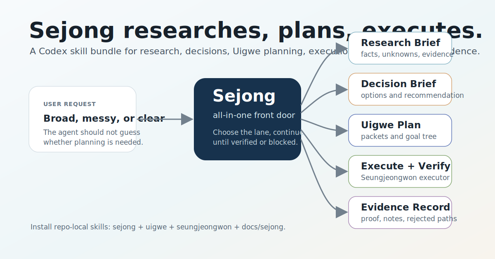

# King Sejong



King Sejong is an all-in-one repo-local skill bundle for **Codex** and Codex-style agent environments.

It gives an agent one broad front door, `$sejong`, for moving from research to decision, planning, execution, verification, and evidence recording.

Uigwe is the formal planning protocol behind that front door. Sejong routes into Uigwe only when a durable planning bundle is useful, then continues to execution and verification when the user asked for an outcome rather than a plan artifact.

This is not a standalone CLI or Python package. It is meant to be copied into a target repository so Codex can load the installed `.agents/skills` files.

## Naming

Use **Sejong**.

Do not write `SeJong`. The conventional romanization is `Sejong`, as in `King Sejong`.

Recommended names:

- Human-facing product name: `King Sejong`
- Skill name: `sejong`
- Invocation: `$sejong`
- Repository slug: `king-sejong`

## Install

Clone this repository, then install the bundle into the repository where you want to use it:

```bash
git clone https://github.com/JoonSCode/king-sejong.git
cd king-sejong
bash scripts/install-sejong.sh /path/to/your-repo
```

To replace an existing install:

```bash
bash scripts/install-sejong.sh --force /path/to/your-repo
```

The installer copies these managed paths into the target repository:

- `.agents/skills/sejong/`
- `.agents/skills/uigwe/`
- `.agents/skills/seungjeongwon/`
- `docs/sejong/`

Keep those paths together. The skills are intentionally small and load their routing, planning, schema, and handoff contracts from `docs/sejong`.

## Codex And Execution

This package is explicitly for Codex-style repo-local skills:

- Codex loads `.agents/skills/sejong/SKILL.md` for `$sejong`.
- Codex loads `.agents/skills/uigwe/SKILL.md` for `$uigwe`.
- Codex loads `.agents/skills/seungjeongwon/SKILL.md` for `$seungjeongwon`.
- Codex can execute clear tasks directly through Sejong's `direct-action` lane.
- The docs include Codex consumer contracts for downstream execution feedback.

Execution is part of Sejong's job, and King Sejong includes its own executor:

- `Seungjeongwon` / `승정원`

Seungjeongwon executes approved scopes or validated Uigwe bundles, verifies the result, and reports evidence.

Sejong can finish work in two ways:

- direct execution in the current Codex session when the task is clear enough
- native Seungjeongwon execution when a plan or bundle needs implementation and verification

Ralph-compatible handoff is still supported for environments that already use Ralph, but it is no longer required for Sejong to execute work.

What is included:

- direct-action routing for clear implementation and verification work
- `Seungjeongwon` native executor skill
- Seungjeongwon execution contract
- `RalphExecutor` docs and schema
- `prepare_ralph_executor.py`
- example `ralph-executor.request/result` artifacts
- optional handoff wording that can be passed to a Ralph-capable Codex environment

What is not included:

- a guarantee that non-Codex hosts understand the handoff automatically

Sejong works for research, decision support, planning, execution, and verification without Ralph.

## Work Loop

Sejong can run the full arc when the user asks for an outcome:

```text
research -> decision -> Uigwe plan -> Seungjeongwon execute -> verify -> record evidence
```

It should only stop early when the next step truly needs missing evidence, a user decision, or an approval gate.

## Use

Use Sejong when the right workflow is not obvious yet:

```text
$sejong research this and tell me whether it should become a plan
$sejong compare these options and recommend the next lane
$sejong turn this approved design into executable work
```

Use Uigwe directly when you already know you want formal planning:

```text
$uigwe full build a browser-based MVP for async interview practice
$uigwe design-to-plan this feature brief
$uigwe decompose-only docs/specs/approved-design.md
```

## Routing Model

| Lane | Use When | Output |
| --- | --- | --- |
| `research-brief` | The facts, history, or evidence are still unclear. | Known facts, inferences, unknowns, next decision. |
| `decision-brief` | The main job is choosing between options. | Options, rejected paths, recommendation, risks. |
| `uigwe-plan` | A durable planning bundle is useful. | Uigwe packets, `spec.md`, `rationale.md`, `goal-tree.json`. |
| `executor-handoff` | A validated bundle needs execution. | Seungjeongwon execution, optionally Ralph-compatible handoff artifacts. |
| `direct-action` | The task is clear enough to do now. | Completed work plus verification evidence. |

Court-inspired aliases are supported as user-facing language:

- `JangYeongsil` -> research
- `Jiphyeonjeon` -> decision support
- `Seungjeongwon` -> executor handoff
- `Sillok` -> evidence records
- `Danjong` -> rejected or retired options

## Read More

- [Sejong router contract](docs/sejong/ROUTER.md)
- [Uigwe protocol](docs/sejong/PROTOCOL.md)
- [Uigwe wrapper](docs/sejong/WRAPPER.md)
- [Seungjeongwon executor](docs/sejong/SEUNGJEONGWON_EXECUTOR.md)
- [RalphExecutor handoff](docs/sejong/RALPH_EXECUTOR.md)
- [Bundle validator](docs/sejong/BUNDLE_VALIDATOR.md)

## License

MIT. This keeps installation and reuse low-friction for personal, internal, and public agent workflows.
